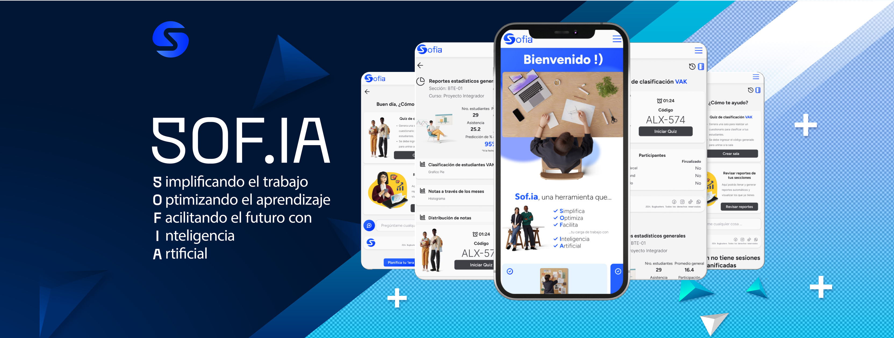

  <!--[](https://opencollective.com/nest#backer)
  [](https://opencollective.com/nest#sponsor)-->

## Description

Lógica de autenticación y autorización para el proyecto Sofia.
Nuestra plataforma orientada para el sector educacional está diseñada para abordar las necesidades y desafíos que enfrentan los docentes en todos los niveles educativos. Ofrece una solución integral que optimiza tanto la planificación de clases como la gestión administrativa, mientras permite una personalización precisa de la enseñanza.



Partiendo de los hallazgos de nuestro estudio, en el que muchos docentes reportaron ciertos grados de niveles de estrés debido a la carga administrativa y desafíos en la docencia como la adaptación de clases para estudiantes con diferentes estilos de aprendizaje, las retroalimentaciones, la gestión del tiempo de las clases y la planificación de estos, hemos identificado la necesidad urgente de herramientas que alivien esta carga. Nuestra plataforma aborda directamente este problema mediante la automatización de tareas repetitivas y la provisión de análisis de datos detallados, liberando tiempo valioso para que los docentes se concentren en desarrollar estrategias pedagógicas adaptadas a las necesidades individuales de cada estudiante, especialmente de aquellos a los que nuestra plataforma "sof.ia" predice que necesitan asistencia según sus promedio y calificaciones. Esto no solo mejora la calidad del tiempo dedicado a la enseñanza, sino que también reduce significativamente el riesgo de estrés y burnout, condiciones que, según el psicólogo Richard Lazarus, pueden surgir de la carga excesiva de trabajo y presión de tiempo, afectando la pasión por la enseñanza y, en última instancia, la calidad educativa (Portoles Osta, 2023).


Lo que distingue a nuestra plataforma de otras herramientas en el mercado es su enfoque integral, que cubre los aspectos más importantes de este problema ya que no sólo abordamos temas administrativos y de gestión si no que nuestro enfoque diferenciador está en la personalización de la enseñanza y el bienestar de los docentes todo integrado en una sola herramienta proporcionando una solución completa,. A diferencia de muchas soluciones existentes que se centran en aspectos administrativos aislados de la buena enseñanza pedagógica, nuestra plataforma combina ambos elementos.

Otra de las características más resaltantes es el enfoque adaptativo ya que nos permitimos ajustarnos a responder a las necesidades y circunstancias cambiantes en tiempo real en un salón de clases , un ejemplo sería  que nuestra plataforma no es estática si no que puede modificar sus recomendaciones basándose en datos reales y actuales de los estudiantes, sus estilos de aprendizaje, y las necesidades de los docentes.


## Repositorios de los microservicios

- Modelo de ML de predicción de Notas: [Repositorio](https://github.com/Gonzagut99/ModeloSofiaPrediccionNotas)
- Modelo de Deep Learning de clasificación VAK: [Repositorio]([LICENSE](https://github.com/Gonzagut99/VAK-Classification))
- Frontend en Remix [Repositorio](https://github.com/Gonzagut99/Sofia-front)

## Instalación

```bash
$ npm install
```

## Correr la app
Recuerda crear los valores de todas las variables de entorno.

```bash
# development
$ npm run start

# watch mode
$ npm run start:dev

# production mode
$ npm run start:prod
```
 "docker:up": "docker-compose up",
    "docker:build": "docker-compose build",
    "prisma:push": "docker exec sofia-back-app-1 npx prisma db push",
    "prisma:generate": "npx prisma generate",
## Correr con docker 
```bash
# Construye la imagen de docker con docker-compose y el Dockerfile
$ npm run docker:build

# Generar el cliente de docker
$ npm run prisma:generate

# Prende una instancia de la imagen de docker en un contenedor. Crea los contenedores tanto de la base de datos como la aplicación Nest
$ npm run docker:up

# Realizar la primera migración del esquema de Prisma
$ npm run prisma:push
```

## Test

```bash
# unit tests
$ npm run test

# e2e tests
$ npm run test:e2e

# test coverage
$ npm run test:cov
```

## Contacto

- Author - [Gonzalo Gutiérrez](https://gonzalogutdev.me)

## License

Sofia is [MIT licensed](LICENSE).

## Referencias

Portolés Osta, J. (2023, 20 de noviembre). El estrés y el síndrome de Burnout en los docentes: Un desafío en la educación del siglo XXI. Revista digital Ventana Abierta. https://revistaventanaabierta.es/el-estres-y-el-sindrome-de-burnout-en-los-docentes-un-desafio-en-la-educacion-del-siglo-xxi/